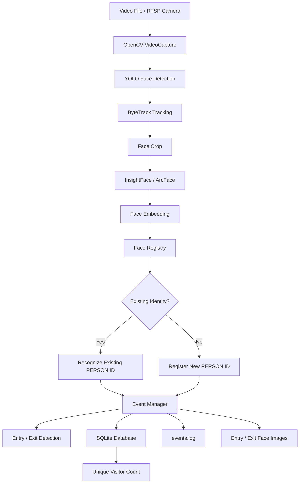

# Intelligent Face Tracker with Auto Registration and Visitor Counting

## 1. Project Overview

The Intelligent Face Tracker is a real-time AI-based video analytics system designed to detect, track, recognize, and count visitors from video streams.

The system combines YOLO-based face detection, ByteTrack object tracking, InsightFace face embeddings, persistent face registration, SQLite database storage, and structured event logging.

The application automatically assigns a unique identity to a newly detected person, recognizes the same person when they appear again, tracks their movement, records entry and exit events, stores timestamped face crops, and maintains a persistent unique visitor count.

The system can process prerecorded videos and is designed to support live camera or RTSP video sources through OpenCV.

---

## 2. Problem Statement

Traditional video monitoring systems require manual observation or separate processing for identifying visitors.

This project automates the process by combining:

* Face detection
* Multi-object tracking
* Face recognition
* Persistent identity management
* Entry and exit detection
* Event logging
* Database storage
* Unique visitor counting

The goal is to create a modular intelligent video-processing pipeline that can recognize returning visitors without counting them as new visitors.

---

## 3. Key Features

### Face Detection

* YOLO-based face detection.
* Configurable confidence threshold.
* Configurable image size.

### Face Tracking

* ByteTrack is used for tracking detected faces.
* Track IDs are maintained while a person remains visible.
* The system handles changes in tracker IDs using persistent face identity.

### Face Recognition

* InsightFace with the Buffalo_L model is used to generate face embeddings.
* Cosine similarity is used to compare embeddings.
* A configurable similarity threshold determines whether a face matches an existing identity.

### Automatic Registration

* Newly detected faces are automatically assigned IDs such as:

  * `PERSON_001`
  * `PERSON_002`
  * `PERSON_003`

### Persistent Identity

* Face embeddings are stored in SQLite.
* Previously registered people can be recognized in later videos or application runs.
* A returning person does not automatically create a new visitor identity.

### Entry and Exit Detection

* An ENTRY event is generated when a person becomes an active visitor session.
* An EXIT event is generated when the person disappears for the configured tracking timeout or when the video finishes.
* Entry and exit timestamps are stored.

### Face Image Storage

Timestamped cropped face images are saved for entry and exit events.

### Event Logging

Critical system events are written to:

```text
logs/events.log
```

The log records events including:

* Registration
* Recognition
* Embedding generation
* Tracking
* Entry
* Exit

### Database

SQLite is used to store:

* Visitor information
* Visit events
* Face embeddings

### Unique Visitor Counting

The database maintains one persistent record per recognized person.

A returning person is associated with the existing `PERSON_xxx` identity instead of creating a new unique visitor.

### Multi-Video Processing

The batch processor automatically discovers supported video files in the `sample/` directory and processes them sequentially.

Supported formats include:

* MP4
* AVI
* MOV
* MKV
* WEBM

### Configurable Processing

Important parameters are controlled through:

```text
config.json
```

including:

* Frame skip
* Detection confidence
* Recognition similarity threshold
* Tracking timeout
* Database path
* Logging paths

---

## 4. Technology Stack

| Component               | Technology               |
| ----------------------- | ------------------------ |
| Programming Language    | Python                   |
| Computer Vision         | OpenCV                   |
| Face Detection          | YOLO                     |
| Face Tracking           | ByteTrack                |
| Face Recognition        | InsightFace / ArcFace    |
| Embedding Comparison    | Cosine Similarity        |
| Database                | SQLite                   |
| Configuration           | JSON                     |
| Logging                 | File-based event logging |
| Video Input             | OpenCV VideoCapture      |
| Development Environment | VS Code                  |

---

## 5. System Architecture



### Processing Flow

```text
Video / RTSP
     ↓
OpenCV
     ↓
YOLO Face Detection
     ↓
ByteTrack
     ↓
Face Crop
     ↓
InsightFace Embedding
     ↓
Face Registry
     ↓
Recognition / Registration
     ↓
Event Manager
     ↓
 ┌───────────────┬────────────────┬─────────────────┐
 ↓               ↓                ↓
SQLite       events.log       Face Images
 ↓
Unique Visitor Count
```

---

## 6. Application Modules

### `app/config.py`

Loads configuration values from `config.json`.

### `app/detector.py`

Provides YOLO-based face detection.

### `app/tracker.py`

Uses YOLO tracking with ByteTrack to maintain temporary track IDs.

### `app/recognizer.py`

Uses InsightFace to generate face embeddings from face crops.

### `app/face_registry.py`

Maintains the mapping between face embeddings and persistent person identities.

It performs:

* Similarity comparison
* Existing identity matching
* New identity registration
* Persistent identity numbering

### `app/database.py`

Handles SQLite operations.

The database contains:

#### `visitors`

Stores persistent visitor identities.

#### `visits`

Stores ENTRY and EXIT events.

#### `face_embeddings`

Stores the face embedding associated with each persistent person ID.

### `app/event_manager.py`

Handles:

* Registration events
* Recognition events
* Tracking events
* Entry events
* Exit events
* Entry/exit image saving
* Track timeout handling

### `app/video_processor.py`

Coordinates the complete processing pipeline for a single video.

### `app/batch_processor.py`

Automatically discovers and processes multiple videos from the `sample/` directory.

---

## 7. Database Design

### Visitors Table

```text
visitors
---------------------------------------
person_id
first_seen
last_seen
visit_count
```

Example:

```text
PERSON_001 | 2026-10-02 23:11:41 | 2026-10-02 23:12:15 | 1
PERSON_004 | 2026-10-02 23:12:39 | 2026-10-02 23:34:28 | 3
PERSON_013 | 2026-10-02 23:13:53 | 2026-10-02 23:35:35 | 8
```

A `visit_count` greater than 1 demonstrates that the same persistent identity was recognized across multiple sessions.

### Visits Table

Stores:

```text
person_id
event_type
timestamp
image_path
track_id
```

Example events:

```text
PERSON_001 | ENTRY | timestamp | image_path | track_id
PERSON_001 | EXIT  | timestamp | image_path | track_id
```

### Face Embeddings Table

Stores the serialized InsightFace embedding for persistent re-identification.

---

## 8. Configuration

The application uses `config.json`.

Example:

```json
{
    "video_source": "sample/input.mp4",
    "detection": {
        "frame_skip": 5,
        "confidence_threshold": 0.5,
        "image_size": 640
    },
    "recognition": {
        "similarity_threshold": 0.45
    },
    "tracking": {
        "max_lost_frames": 30
    },
    "database": {
        "path": "data/visitors.db"
    },
    "logging": {
        "event_log": "logs/events.log",
        "entry_directory": "logs/entries",
        "exit_directory": "logs/exits"
    }
}
```

### Important Configuration Parameters

`frame_skip`

Controls how frequently frames are processed.

`confidence_threshold`

Controls the minimum YOLO detection confidence.

`similarity_threshold`

Controls the minimum cosine similarity required for face identity matching.

`max_lost_frames`

Controls how long a tracked person can remain undetected before an EXIT event is generated.

---

## 9. Setup Instructions

### 9.1 Clone the Repository

```bash
git clone https://github.com/oosoowhat-png/intelligent-face-tracker.git
cd intelligent-face-tracker
```

### 9.2 Create a Virtual Environment

Windows:

```powershell
python -m venv venv
```

Activate it:

```powershell
venv\Scripts\activate
```

### 9.3 Install Dependencies

```powershell
pip install -r requirements.txt
```

### 9.4 Model

Place the YOLO face model inside:

```text
models/yolov8n-face.pt
```

### 9.5 Add Input Videos

Place input videos inside:

```text
sample/
```

The batch processor automatically discovers supported video files.

---

## 10. Running the Application

### Single Video

The video processor can process an individual video through the application pipeline.

### Multiple Videos

Run:

```powershell
python -m app.batch_processor
```

The batch processor scans the `sample/` directory and processes all supported video files.

### Test

Run:

```powershell
python tests/test_video_processor.py
```

---

## 11. Output Structure

The application generates:

```text
data/
└── visitors.db

logs/
├── events.log
├── entries/
│   └── PERSON_xxx_timestamp.jpg
└── exits/
    └── PERSON_xxx_timestamp.jpg
```

The database contains the persistent visitor records and event history.

---

## 12. Sample Validation Result

The system was tested using all 23 provided sample videos.

Final test database result:

```text
Total videos processed: 23

Unique visitors: 97

ENTRY events: 144
EXIT events: 144
```

The presence of visitor records with multiple visits demonstrates persistent identity recognition across processing sessions.

Example:

```text
PERSON_004  visit_count = 3
PERSON_009  visit_count = 3
PERSON_012  visit_count = 5
PERSON_013  visit_count = 8
PERSON_014  visit_count = 6
```

The system therefore distinguishes between a persistent visitor identity and individual visit sessions.

---

## 13. Event Logging

The mandatory event log is:

```text
logs/events.log
```

The application records events such as:

```text
REGISTRATION
EMBEDDING
TRACKING
ENTRY
RECOGNITION
EXIT
```

This provides an auditable history of the AI processing pipeline.

---

## 14. Sample Output

### Entry Image

Entry images are stored under:

```text
logs/entries/
```

Example:

```text
PERSON_001_20261002_231141_123456.jpg
```

### Exit Image

Exit images are stored under:

```text
logs/exits/
```

Example:

```text
PERSON_001_20261002_231215_123456.jpg
```

### Event Log

```text
Registration: PERSON_001
Embedding generated: PERSON_001
Tracking: PERSON_001
Entry: PERSON_001
Recognition: PERSON_001
Tracking: PERSON_001
Exit: PERSON_001
```

---

## 15. AI Planning

The application was developed using an AI-assisted development workflow.

The planning process was divided into the following stages:

1. Requirement analysis
2. Feature identification
3. System architecture design
4. Face detection implementation
5. Face tracking implementation
6. Face embedding generation
7. Persistent identity registration
8. Database integration
9. Entry/exit event management
10. Multi-video processing
11. Testing and validation
12. Documentation and final integration

Detailed AI planning and development prompts are documented in:

```text
docs/AI_PLANNING.md
```

---

## 16. Compute Load Estimate

The application is primarily an inference and video-processing workload.

### CPU Workload

CPU operations include:

* OpenCV video decoding
* Frame handling
* Face crop extraction
* SQLite database operations
* File I/O
* Event logging
* Application orchestration

### GPU Workload

When GPU acceleration is available, the main GPU-intensive components are:

* YOLO face detection/tracking
* InsightFace neural network inference

### CPU-only Operation

The current InsightFace implementation uses:

```python
providers=["CPUExecutionProvider"]
```

Therefore the recognition pipeline can run without a dedicated GPU.

### Expected Resource Characteristics

The main factors affecting compute load are:

* Input video resolution
* Video FPS
* Number of detected faces
* Frame-skip value
* YOLO model size
* InsightFace model
* CPU/GPU hardware

Increasing `frame_skip` reduces the number of processed frames and therefore reduces computational load, at the cost of lower temporal processing frequency.

For a production deployment, GPU inference and additional optimization such as batching or asynchronous processing could be used to improve throughput.

---

## 17. Assumptions

The following assumptions were made:

1. Input videos contain visible human faces.
2. Face crops contain enough facial information for InsightFace embedding generation.
3. A similarity threshold is used to determine identity matches.
4. ByteTrack track IDs are considered temporary and are not used as permanent person identities.
5. Persistent identity is based on stored face embeddings.
6. A person disappearing for the configured tracking timeout is treated as having exited.
7. If a person is still active when a video ends, the system flushes the active session and records an EXIT event.
8. SQLite is sufficient for the hackathon-scale workload.
9. Input videos are locally accessible during batch processing.
10. RTSP sources can be provided to OpenCV VideoCapture in environments where the corresponding stream is accessible.

---

## 18. Scalability

The system is modular so that individual components can be replaced or improved independently.

Possible future improvements include:

* GPU-accelerated inference
* Multiple face embeddings per visitor
* Embedding averaging
* More advanced re-identification strategies
* PostgreSQL for larger deployments
* Redis-based state management
* Asynchronous video processing
* Distributed processing
* Real-time dashboard
* Web-based monitoring interface
* Docker deployment
* Cloud-based video processing

---

## 19. Testing

The implementation was tested with:

* Individual video processing
* Persistent face identity across runs
* Entry/exit event generation
* ByteTrack ID changes
* SQLite persistence
* Event logging
* Cropped face image generation
* Multi-video processing
* 23 provided sample videos

Final multi-video validation:

```text
23 videos processed
97 unique visitors
144 ENTRY events
144 EXIT events
```

---

## 20. AI-Assisted Development

AI coding assistance was used during development for:

* Application architecture planning
* Modular Python design
* YOLO integration
* InsightFace integration
* SQLite schema design
* Face registration logic
* Event management
* Error handling
* Testing support
* Documentation

The generated code was reviewed, tested, modified, and integrated into the application.

The developer understands the purpose and operation of the generated modules and can explain the implementation during technical evaluation.

The development prompts and planning workflow are documented in:

```text
docs/AI_PLANNING.md
```

---

## 21. Demonstration Video

A demonstration video explaining the architecture, implementation, execution, logging, database, and test results is available here:

**YouTube:** `https://youtu.be/x_pvGBGbanU`

---


## 22. Repository

GitHub repository:

**https://github.com/oosoowhat-png/intelligent-face-tracker**

---

## 23. Conclusion

The Intelligent Face Tracker combines computer vision, face recognition, multi-object tracking, persistent identity management, structured logging, and database storage into a modular intelligent video analytics system.

The system was validated against 23 sample videos and successfully maintained persistent visitor identities while recording entry and exit events.

This project is a part of a hackathon run by https://katomaran.com
